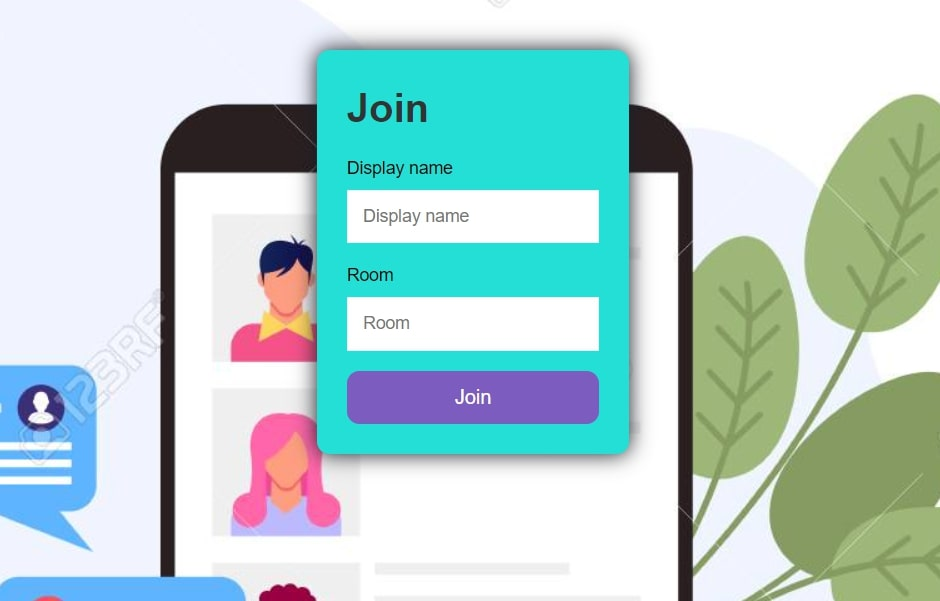
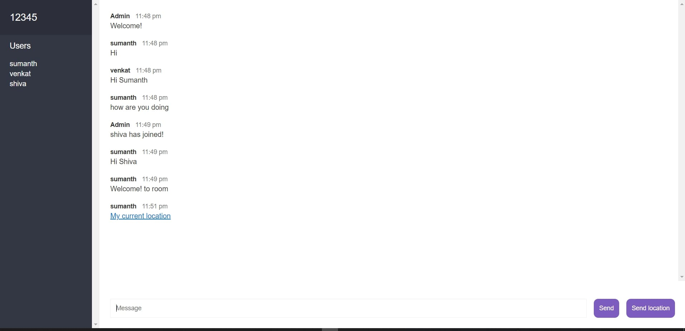
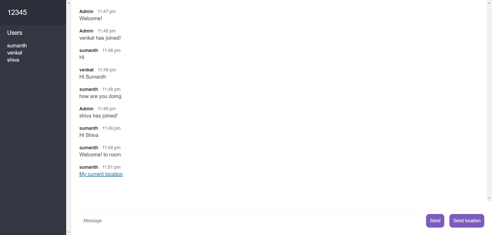

# Chat-App

Developed a chatting application using Node JS, HTML, CSS an Socket.Io library to allow user to create room and chat with other users who joins the room.

A room hast to be created with unique name and user has to join the room with a name he can share the room name to other users so the other users can join the room.

User can send his location to other users.It displays all the notification when a new user joins and if a user left and it 

## Dependies

1. bad-words

2. express

3. nodemon

4. socket.io

## Demo

### Screenshot1

1) this displays the front page of the application

### Screenshot2

2) Users and room number can be seen on the left side 

### Screenshot3

3) you can share your location and all the notification when a user left or joinded are alo shown
